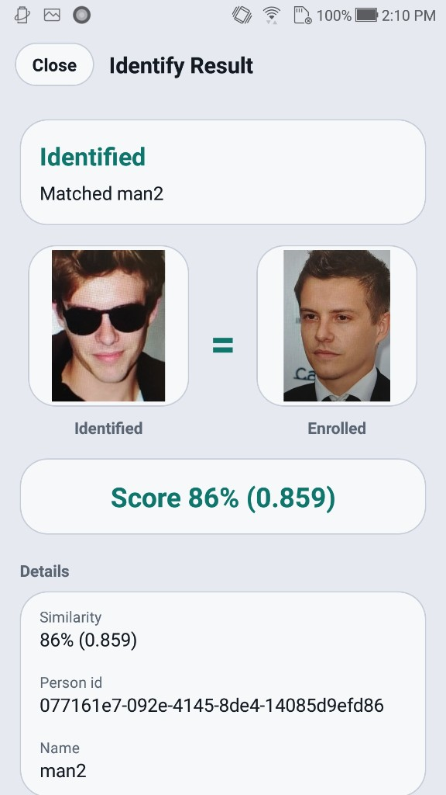

# Face Recognition Flutter SDK


## Overview

Flutter face recognition plugin for Android and iOS: enrollment, 1:N identification, and face attributes. Passive liveness is available when the license allows it.

Everything runs **on-premise** (on the phone or on your server). Identixia does **not** receive biometric images or templates.

| | |
| --- | --- |
| **Product repository** | `FaceRecognition-LivenessDetection-Flutter` |
| **Platform** | Flutter |
| **Docs site** | [docs.identixia.com](https://docs.identixia.com) |


### Repository



Source: [`identixia-IDV/FaceRecognition-LivenessDetection-Flutter`](https://github.com/identixia-IDV/FaceRecognition-LivenessDetection-Flutter)

## What you can do

| Capability | Description |
| --- | --- |
| Detect faces | Bounding box, landmarks, pose |
| Attributes | Age / gender / expression-style traits when enabled |
| Image / face quality | ICAO-style quality scores |
| Templates | Compact face feature vectors you store yourself |
| 1:1 match | Compare two images or two templates |
| 1:N identify | Enroll gallery + live search (mobile VideoWorker / server gallery) |
| Passive liveness | Presentation-attack score when the license includes it |

## Prerequisites

| Requirement | Detail |
| --- | --- |
| Flutter | Stable channel, recent SDK |
| Android | JDK 17, physical arm64 device |
| iOS | Xcode + CocoaPods; physical iPhone |
| Bootstrap | Run the sample `tool/bootstrap.dart` / `pod install` as documented in the repo |

## Quick start

### 1. Clone the sample

```bash
git clone https://github.com/identixia-IDV/FaceRecognition-LivenessDetection-Flutter.git
cd FaceRecognition-LivenessDetection-Flutter
```

### 2. Place the runtime

Engine zip/AAR/framework from GitHub Releases (`/releases/latest/download/…`) or the files already under `libfacesdk` / Frameworks when present.

Clients should download versioned assets via:

```text
https://github.com/identixia-IDV/FaceRecognition-LivenessDetection-Flutter/releases/latest/download/<asset>
```

### 3. Run the demo

Follow the repository **Run** section (Android Studio / Xcode / `flutter run` / `yarn android` / Ionic). Wait until status shows **Ready** before opening camera modes.

### 4. Try every demo mode

Use each tile / screen once (enroll, identify, capture, document front/back, result, about). Confirm license state on the About / Result screen.


## License and activation (mobile)

| | |
| --- | --- |
| **Demo id** | `com.identixia.facerecognitionsdk` (Android) / matching iOS bundle id in the sample |
| **Demo key** | Bundled for the sample id only |
| **Your app** | New applicationId / bundle id → request a new license |

### Activate → init (concept)

1. Call activate with your license string (background thread).
2. On success, call init (unpacks on-device models; may take a few seconds the first time).
3. Gate UI on Ready / license status before camera modes.
4. Never paste the demo key into a production app id.


### Status codes

| Code | Meaning |
| ---: | ------- |
| `0` | Success |
| `1` / `-1` | Invalid license |
| `2` / `-2` | Wrong application / bundle id |
| `3` / `-3` | License expired |
| `4` / `-4` | Not activated |
| `-5` | Init / model load failed |
| `-10` | Invalid argument |
| `-11` | Invalid image |
| `-12` | No face |
| `-13` | No document |
| `-16` | Liveness failed (when gated) |

Serialize native SDK calls on **one background thread**. The engine is not concurrent.


## API reference — mobile face SDK

Prefer **`FaceRecognitionClient`** (Android kit) / the matching iOS kit wrappers. Serialize all engine calls on one queue.

### Lifecycle

| API | Purpose |
| --- | --- |
| `activate(license)` | Activate + init on a worker thread; completion returns status code |
| `deactivate()` / `release()` | Tear down engine |
| `getLicenseStatus()` | Current license flags |
| `allowsRecognition()` / `allowsLiveness()` | Capability checks |

### Still-image recognition

| API | Purpose |
| --- | --- |
| `detect(bitmap, crop?, flags?)` | Detect faces; JSON string with regions / landmarks / traits |
| `faceDetection(bitmap, param?)` | Typed `FaceBox` list |
| `templateExtraction(bitmap, face)` | Template bytes for one face box |
| `extractFeature(bitmap)` | Feature bytes (largest / primary face helpers) |
| `similarity(feature1, feature2)` | 1:1 score between templates |
| `quality(bitmap, crop?)` | Quality attributes JSON |
| `setLandmarkMode(14\|68)` | Landmark density |

### Gallery (on-device 1:N)

| API | Purpose |
| --- | --- |
| `enroll(name, feature, thumbnail?)` | Store person locally |
| `bestMatch(feature, threshold)` | 1:N search |
| `enrolledPeople()` / `removeEnrolled` / `clearEnrolled` | Gallery management |
| `syncDatabase(matchThreshold)` | Push templates into VideoWorker DB |

### Live camera (VideoWorker)

| API | Purpose |
| --- | --- |
| `startVideoWorker(config)` | Start tracking / identify session |
| `addFrame(bitmap)` | Push camera frames |
| `setVideoWorkerEventHandler` | Receive track / match / liveness events (JSON) |
| `stopVideoWorker()` | Stop session |
| `makeTrackingConfig` / `makeIdentityConfig` | Build configs (passive / active liveness options when licensed) |

### Passive liveness

When the license includes liveness, still-image detect/quality paths and VideoWorker configs can return passive 2D scores. Use `passive2DVerdict` helpers in the kit. Without the entitlement, treat missing scores as **not run**, not as pass.

### Integration checklist

1. Apply `install.gradle` (Android) or vendor iOS frameworks from Release.
2. `FaceRecognitionClient.get(context).activate(license) { code -> … }`.
3. On `0`, enable camera modes.
4. Enroll → Identify, or Capture / Attribute for still flows.
5. Persist templates in **your** database if you leave the demo gallery.

## Troubleshooting

| Symptom | What to check |
| --- | --- |
| Invalid license | Application / bundle id must match the key; server needs the correct machine code |
| Init failed | Runtime AAR/framework/`lib` missing or wrong ABI |
| No face / no document | Lighting, crop, distance; try still gallery image first |
| Liveness / authenticity empty | License flag off — request the matching entitlement |
| Camera black / crash | Use a **physical** device; grant camera permission |
| Docker license fails after bare-metal license | Machine codes differ — re-license the container |

## Related platforms

| Platform | Docs |
| --- | --- |
| Android | [Face Recognition Android SDK](face-recognition-android-sdk.md) |
| iOS | [Face Recognition iOS SDK](face-recognition-ios-sdk.md) |
| Flutter | [Face Recognition Flutter SDK](face-recognition-android-sdk-2.md) |
| React Native | [Face Recognition React Native SDK](face-recognition-android-sdk-1.md) |
| Ionic Capacitor | [Face Recognition Ionic Capacitor SDK](face-recognition-ionic-capacitor-sdk.md) |
| Ionic Cordova | [Face Recognition Ionic Cordova SDK](face-recognition-android-sdk-3.md) |
| Windows (+ liveness) | [Face Recognition + Liveness Windows](face-recognition-sdk-windows.md) |
| Linux / Docker (+ liveness) | [Face Recognition + Liveness Linux](face-recognition-sdk-linux.md) |
| Windows (recognition only) | [Face Recognition Windows](face-recognition-windows-sdk.md) |
| Linux (recognition only) | [Face Recognition Linux](face-recognition-linux-sdk.md) |

## Screenshots

<figure><figcaption>Flutter camera</figcaption></figure>

<figure><figcaption>Flutter result</figcaption></figure>

<figure><figcaption>Android home (same product family)</figcaption></figure>

<figure><figcaption>Android identify</figcaption></figure>


## Support



## Product README (reference)

Adapted from the shipping repository README for exact commands and platform-specific notes. Screenshots above use the current Identixia asset pack.

## Identixia Face Recognition — Flutter

**On-device face recognition SDK** plugin: enroll, **1:N identification**, guided capture, attributes, and optional **passive face liveness**. Face template matching runs on the device — **no** biometric frames uploaded to Identixia cloud. Ideal for KYC selfie checks and private galleries inside your mobile app.

Package: `face_recognition_sdk`. Demo modes: **Enroll · Identify · Capture · Attribute**.

---

## Basics

Read this once before cloning. Plugin demos ship a **bundled license** for the sample Android / iOS ids. Production apps need a new key. [Initial commands](#-initial-commands) lists clone → place runtime → run → activate options.

| Topic | Basic information |
| --- | --- |
| **Product** | On-device **face recognition** Flutter plugin |
| **Modes** | Enroll · Identify (1:N) · Capture · Attribute |
| **API** | Detect · templates · identify · optional passive liveness |
| **Runtime** | Local example engines, or the `v1.0.0` GitHub Release when missing |
| **Demo id** | `com.identixia.facerecognitionsdk` / `com.identixia.facerecognitionsdk.app` |
| **Tools** | Flutter 3.44+ · physical arm64 Android / iPhone |
| **UI** | Four demo modes after Ready · package kit `FaceCapture` |
| **Privacy** | Templates stay on device — no Identixia cloud |

---

## Initial commands

Must-know path for the sample / example app.

```bash
git clone https://github.com/identixia-IDV/FaceRecognition-LivenessDetection-Flutter.git
cd FaceRecognition-LivenessDetection-Flutter
dart run tool/bootstrap.dart
cd example && flutter run
```

Please [contact us](#-contact) to get a license for your own app. The sample already includes a demo license for its application id.

Wait until Home = **Ready**, then Enroll / Identify / Capture / Attribute.

---

## What you get

| Capability | What it does |
| --- | --- |

---

## Demo modes

| Mode | What to try |
| --- | --- |
| **Enroll** | Create an on-device gallery entry (template + thumbnail) |
| **Identify** | Live 1:N search against enrolled faces |
| **Capture** | Guided still capture with quality feedback |
| **Attribute** | Attribute scores when enabled |

---

## Requirements

| | |
| --- | --- |
| Devices | Physical **arm64** Android and/or **iPhone** |
| Package | `face_recognition_sdk` |
| Runtimes | Local example engines, or the `v1.0.0` GitHub Release when they are missing |

---

## Install

The example builds with native runtimes already in the clone when present. Gradle / CocoaPods download the `v1.0.0` GitHub Releases only when a file is missing.

- AAR → `example/android/libfacesdk/facerecognitionsdk.aar`
- iOS → `ios/Frameworks/` (`facerecognitionsdk`, `FaceRecognitionEngine`, `onnxruntime`)

Customer apps depend on `face_recognition_sdk` from this repo at tag `v1.0.0` (Flutter: git dependency; React Native / Ionic: npm / github package). Do **not** use a monorepo `path:` dependency in shipping apps.

Android: keep `packaging { jniLibs { useLegacyPackaging = true } }` so `libFaceRecognitionEngine.so` is extracted for `nativeInitEngine`.

---

## Run

```bash
git clone https://github.com/identixia-IDV/FaceRecognition-LivenessDetection-Flutter.git
cd FaceRecognition-LivenessDetection-Flutter
dart run tool/bootstrap.dart
cd example && flutter run   # physical device
```

After Ready, open **Enroll · Identify · Capture · Attribute**.

---

## License

Demo ids: Android `com.identixia.facerecognitionsdk` · iOS `com.identixia.facerecognitionsdk.app`.

The code below shows how to use the license:

[https://github.com/identixia-IDV/FaceRecognition-LivenessDetection-Flutter/blob/7ecff0aaeab88156283abca007e07f15e9381976/example/lib/core/constants/license.dart#L6-L14](https://github.com/identixia-IDV/FaceRecognition-LivenessDetection-Flutter/blob/7ecff0aaeab88156283abca007e07f15e9381976/example/lib/core/constants/license.dart#L6-L14)

[https://github.com/identixia-IDV/FaceRecognition-LivenessDetection-Flutter/blob/7ecff0aaeab88156283abca007e07f15e9381976/example/lib/services/sdk_service.dart#L28-L39](https://github.com/identixia-IDV/FaceRecognition-LivenessDetection-Flutter/blob/7ecff0aaeab88156283abca007e07f15e9381976/example/lib/services/sdk_service.dart#L28-L39)

Capabilities: face recognition (detect / templates / match) and/or passive face liveness. Please [contact us](#-contact) to get a license for **your own app**.

---

## Use in your app

Depend on `face_recognition_sdk` via git (`ref: v1.0.0`), set Android `useLegacyPackaging = true`, then use `FaceCapture` / activate → init → detect / template / identify.

Typical flow: depend on `face_recognition_sdk` at `v1.0.0` → ship / download native runtimes → activate → init → enroll / identify / capture. Prefer package kits (`FaceCapture`, …) over reinventing the camera UI. Keep demo ids only while using sample licenses.

| Step | Detail |
| --- | --- |
| 1 | Depend on `face_recognition_sdk` at tag `v1.0.0` (standalone clone — no monorepo `path:`) |
| 2 | Keep or download Android AAR + iOS frameworks (`v1.0.0` Release) |
| 3 | Activate → init on a physical device (`useLegacyPackaging = true` on Android) |
| 4 | Wire Enroll / Identify (1:N) / Capture / Attribute (+ liveness if licensed) |

---

## Platforms

| | Platform | Repo |
| --- | --- | --- |

---
