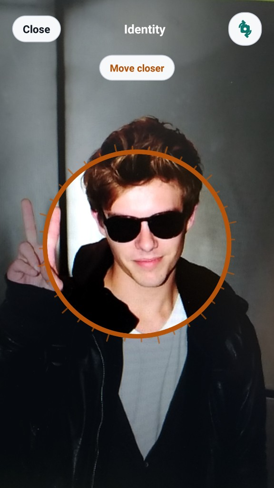
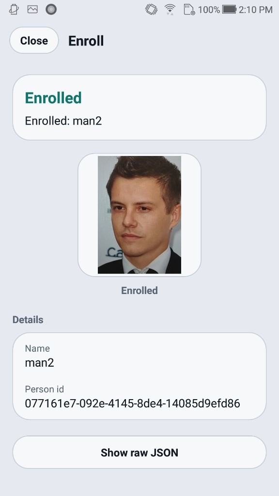
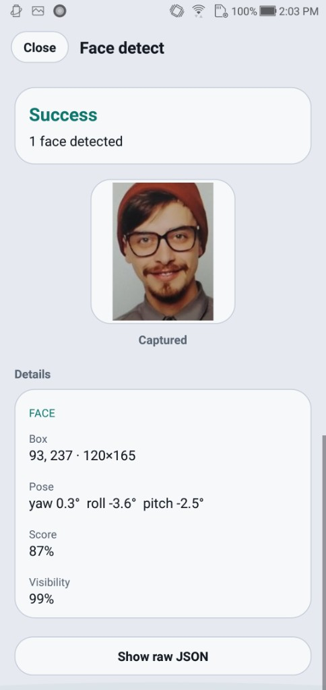
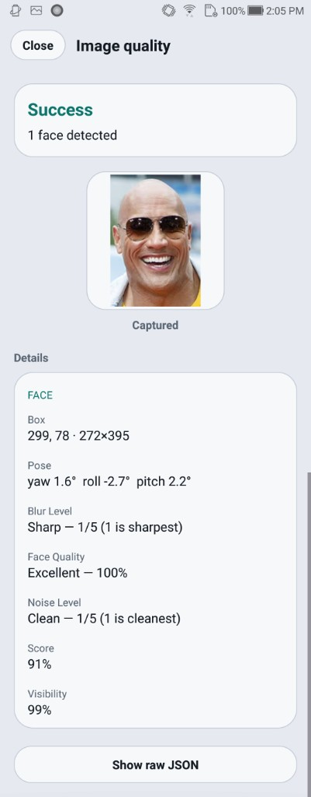
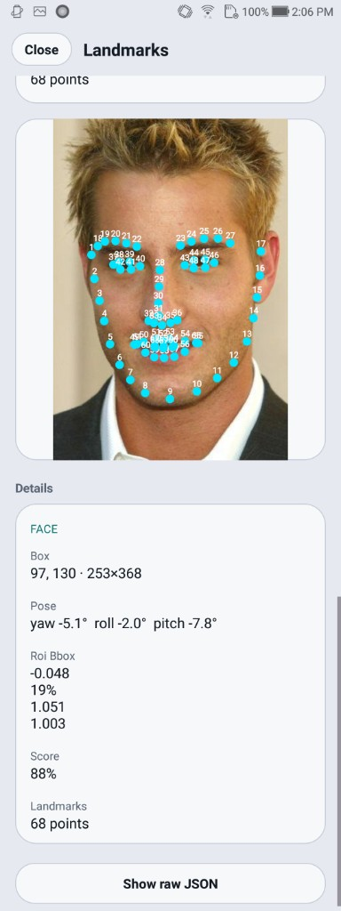
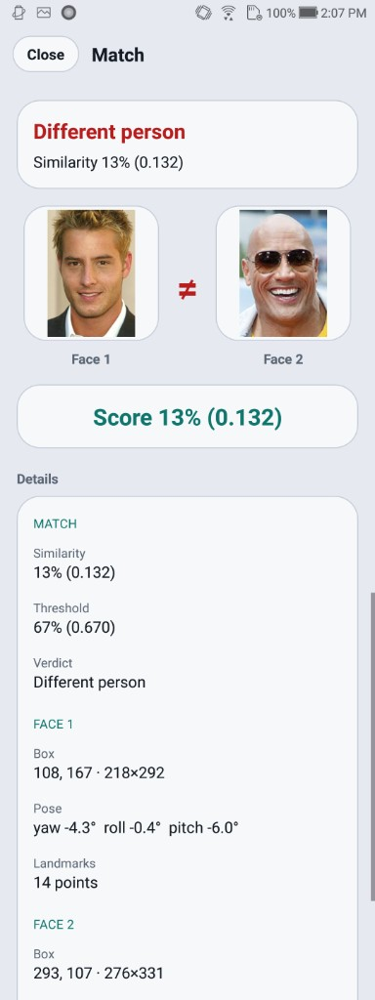
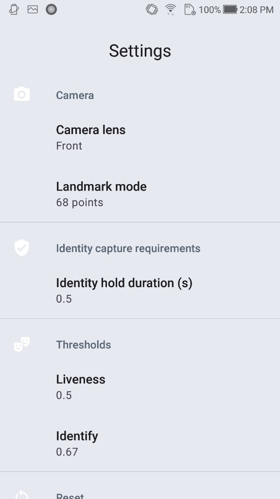
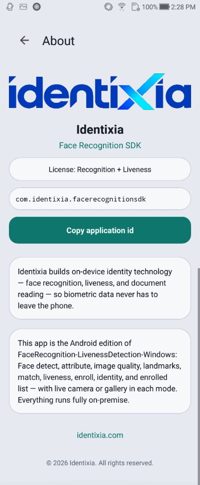

# Face SDK — Ionic Cordova


## Overview

Ionic Cordova face recognition plugin for Android and iOS: enrollment, 1:N identification, and face attributes. Passive liveness is available when the license allows it.

Processing runs **on the device**. Identixia does **not** receive biometric images, templates, or document scans.

| | |
| --- | --- |
| **Repository** | [`FaceRecognition-LivenessDetection-Ionic-Cordova`](https://github.com/identixia-IDV/FaceRecognition-LivenessDetection-Ionic-Cordova) |
| **Platform** | Ionic-Cordova |
| **Documentation** | [docs.identixia.com](https://docs.identixia.com) |


## Repository



[`identixia-IDV/FaceRecognition-LivenessDetection-Ionic-Cordova`](https://github.com/identixia-IDV/FaceRecognition-LivenessDetection-Ionic-Cordova) · [Releases](https://github.com/identixia-IDV/FaceRecognition-LivenessDetection-Ionic-Cordova/releases/latest)

## Capabilities

| Capability | Description |
| --- | --- |
| Face detection | Bounding box, landmarks, and pose |
| Attributes | Age, gender, and related traits when enabled |
| Quality | ICAO-style image and face quality scores |
| Templates | Compact feature vectors stored in **your** database |
| 1:1 match | Compare two images or two templates |
| 1:N identify | Enroll a gallery and search (mobile VideoWorker / server gallery) |
| Passive liveness | Presentation-attack score when the license includes `liveness` |

## Prerequisites

| Requirement | Detail |
| --- | --- |
| Node | 18+ |
| Ionic CLI | Current stable |
| Android / iOS | Native toolchains as for Capacitor or Cordova |
| Device | Physical phone for camera capture |

## Quick start

### 1. Clone the sample

```bash
git clone https://github.com/identixia-IDV/FaceRecognition-LivenessDetection-Ionic-Cordova.git
cd FaceRecognition-LivenessDetection-Ionic-Cordova
```

### 2. Place the runtime

Engine zip/AAR/framework from GitHub Releases (`/releases/latest/download/…`) or the files already under `libfacesdk` / Frameworks when present.

Clients should download versioned assets via:

```text
https://github.com/identixia-IDV/FaceRecognition-LivenessDetection-Ionic-Cordova/releases/latest/download/<asset>
```

### 3. Run the demo

Follow the repository **Run** section (Android Studio / Xcode / `flutter run` / `yarn android` / Ionic). Wait until status shows **Ready** before opening camera modes.

### 4. Try every demo mode

Use each tile / screen once (enroll, identify, capture, document front/back, result, about). Confirm license state on the About / Result screen.


## License and activation (mobile)

| | |
| --- | --- |
| **Demo id** | `com.identixia.facerecognitionsdk` (Android) / matching iOS bundle id in the sample |
| **Demo key** | Bundled for the sample id only |
| **Your app** | New applicationId / bundle id → request a new license |

### Activate → init (concept)

1. Call activate with your license string (background thread).
2. On success, call init (unpacks on-device models; may take a few seconds the first time).
3. Gate UI on Ready / license status before camera modes.
4. Never paste the demo key into a production app id.


### Status codes

| Code | Meaning |
| ---: | ------- |
| `0` | Success |
| `1` / `-1` | Invalid license |
| `2` / `-2` | Wrong application / bundle id |
| `3` / `-3` | License expired |
| `4` / `-4` | Not activated |
| `-5` | Init / model load failed |
| `-10` | Invalid argument |
| `-11` | Invalid image |
| `-12` | No face |
| `-13` | No document |
| `-16` | Liveness failed (when gated) |

Serialize native SDK calls on **one background thread**. The engine is not concurrent.


## API reference — mobile face SDK

Prefer **`FaceRecognitionClient`** (Android kit) / the matching iOS kit wrappers. Serialize all engine calls on one queue.

### Lifecycle

| API | Purpose |
| --- | --- |
| `activate(license)` | Activate + init on a worker thread; completion returns status code |
| `deactivate()` / `release()` | Tear down engine |
| `getLicenseStatus()` | Current license flags |
| `allowsRecognition()` / `allowsLiveness()` | Capability checks |

### Still-image recognition

| API | Purpose |
| --- | --- |
| `detect(bitmap, crop?, flags?)` | Detect faces; JSON string with regions / landmarks / traits |
| `faceDetection(bitmap, param?)` | Typed `FaceBox` list |
| `templateExtraction(bitmap, face)` | Template bytes for one face box |
| `extractFeature(bitmap)` | Feature bytes (largest / primary face helpers) |
| `similarity(feature1, feature2)` | 1:1 score between templates |
| `quality(bitmap, crop?)` | Quality attributes JSON |
| `setLandmarkMode(14\|68)` | Landmark density |

### Gallery (on-device 1:N)

| API | Purpose |
| --- | --- |
| `enroll(name, feature, thumbnail?)` | Store person locally |
| `bestMatch(feature, threshold)` | 1:N search |
| `enrolledPeople()` / `removeEnrolled` / `clearEnrolled` | Gallery management |
| `syncDatabase(matchThreshold)` | Push templates into VideoWorker DB |

### Live camera (VideoWorker)

| API | Purpose |
| --- | --- |
| `startVideoWorker(config)` | Start tracking / identify session |
| `addFrame(bitmap)` | Push camera frames |
| `setVideoWorkerEventHandler` | Receive track / match / liveness events (JSON) |
| `stopVideoWorker()` | Stop session |
| `makeTrackingConfig` / `makeIdentityConfig` | Build configs (passive / active liveness options when licensed) |

### Passive liveness

When the license includes liveness, still-image detect/quality paths and VideoWorker configs can return passive 2D scores. Use `passive2DVerdict` helpers in the kit. Without the entitlement, treat missing scores as **not run**, not as pass.

### Integration checklist

1. Apply `install.gradle` (Android) or vendor iOS frameworks from Release.
2. `FaceRecognitionClient.get(context).activate(license) { code -> … }`.
3. On `0`, enable camera modes.
4. Enroll → Identify, or Capture / Attribute for still flows.
5. Persist templates in **your** database if you leave the demo gallery.

## Troubleshooting

| Symptom | What to check |
| --- | --- |
| Invalid license | Application / bundle id must match the key; server needs the correct machine code |
| Init failed | Runtime AAR/framework/`lib` missing or wrong ABI |
| No face / no document | Lighting, crop, distance; try still gallery image first |
| Liveness / authenticity empty | License flag off — request the matching entitlement |
| Camera black / crash | Use a **physical** device; grant camera permission |
| Docker license fails after bare-metal license | Machine codes differ — re-license the container |

## Related platforms

Keep the same license product line across stacks. From the [Face SDK](README.md) hub:

| Platform | Docs |
| --- | --- |
| Android (full) | [Android](android.md) |
| iOS (full) | [iOS](ios.md) |
| Flutter (full) | [Flutter](flutter.md) |
| React Native (full) | [React Native](react-native.md) |
| Ionic Capacitor (full) | [Ionic Capacitor](ionic-capacitor.md) |
| Ionic Cordova (full) | [Ionic Cordova](ionic-cordova.md) |
| Windows (full) | [Windows](windows.md) |
| Linux / Docker (full) | [Linux / Docker](linux-docker.md) |
| Windows (recognition only) | [Recognition Windows](recognition-windows.md) |
| Linux (recognition only) | [Recognition Linux / Docker](recognition-linux-docker.md) |
| Liveness-only | [Android](liveness-android.md) · [iOS](liveness-ios.md) · [Windows](liveness-windows.md) · [Docker](liveness-linux-docker.md) |
| Function guides | [Recognition](recognition.md) · [Liveness](liveness.md) |

## Screenshots

<figure><figcaption>Home</figcaption></figure>

<figure><figcaption>Capture</figcaption></figure>

<figure><figcaption>Enroll</figcaption></figure>

<figure><figcaption>Identify</figcaption></figure>

<figure><figcaption>Detect</figcaption></figure>

<figure><figcaption>Attributes</figcaption></figure>

<figure><figcaption>Quality</figcaption></figure>

<figure><figcaption>Landmarks</figcaption></figure>

<figure><figcaption>Match</figcaption></figure>

<figure><figcaption>Liveness</figcaption></figure>

<figure><figcaption>Settings</figcaption></figure>

<figure><figcaption>About</figcaption></figure>

## Next steps

1. Complete **Quick start** until the sample shows **Ready**.
2. Activate with a license issued for **your** application id or machine code.
3. Call only the APIs your license allows; treat missing flags as “not evaluated”, not as pass.
4. Return to the [Face SDK](README.md) hub for recognition, liveness, and related platforms.


## Support



## Repository README

The following notes are adapted from the shipping repository README (exact commands and platform-specific details). Screenshots on this page use the Identixia documentation asset pack.

## Identixia Face Recognition — Ionic Cordova

**On-device face recognition SDK** plugin: enroll, **1:N identification**, guided capture, attributes, and optional **passive face liveness**. Face template matching runs on the device — **no** biometric frames uploaded to Identixia cloud. Ideal for KYC selfie checks and private galleries inside your mobile app.

Package: `face-recognition-cordova`. Demo modes: **Enroll · Identify · Capture · Attribute**.

**Cordova**. Capacitor: [FaceRecognition-LivenessDetection-Ionic-Capacitor](https://github.com/identixia-IDV/FaceRecognition-LivenessDetection-Ionic-Capacitor).

---

## Basics

Read this once before cloning. Plugin demos ship a **bundled license** for the sample Android / iOS ids. Production apps need a new key. [Initial commands](#-initial-commands) lists clone → place runtime → run → activate options.

| Topic | Basic information |
| --- | --- |
| **Product** | On-device **face recognition** Ionic Cordova plugin |
| **Modes** | Enroll · Identify (1:N) · Capture · Attribute |
| **API** | Detect · templates · identify · optional passive liveness |
| **Runtime** | Android AAR + iOS frameworks from Drive zips `PENDING` |
| **Demo id** | `com.identixia.facerecognitionsdk` (see `config.xml`) |
| **Tools** | npm · Cordova · physical arm64 Android / iPhone |
| **UI** | Four demo modes after Ready |
| **Privacy** | Templates stay on device — no Identixia cloud |

---

## Initial commands

Must-know path for the sample / example app.

```bash
git clone https://github.com/identixia-IDV/FaceRecognition-LivenessDetection-Ionic-Cordova.git
cd FaceRecognition-LivenessDetection-Ionic-Cordova
# place runtimes first
npm install
npm run setup:android && npm run android
npm run setup:ios && npm run ios
```

Please [contact us](#-contact) to get a license for your own app. The sample already includes a demo license for its application id.

Wait until Home = **Ready**, then Camera / Gallery. Confirm Result / About shows a licensed state.

---

## What you get

| Capability | What it does |
| --- | --- |

---

## Demo modes

| Mode | What to try |
| --- | --- |
| **Enroll** | Create an on-device gallery entry (template + thumbnail) |
| **Identify** | Live 1:N search against enrolled faces |
| **Capture** | Guided still capture with quality feedback |
| **Attribute** | Attribute scores when enabled |

---

## Requirements

| | |
| --- | --- |
| Devices | Physical **arm64** Android and/or **iPhone** |
| Package | `face-recognition-cordova` |
| Runtimes | Local example engines, or the `v1.0.0` GitHub Release when they are missing |

---

## Install

The example builds with native runtimes already in the clone when present. Gradle / CocoaPods download the `v1.0.0` GitHub Releases only when a file is missing.

- `Identixia/src/android/facerecognitionsdk.aar`
- `Identixia/src/ios/Frameworks/`

Customer apps depend on `face-recognition-cordova` from this repo at tag `v1.0.0` (Flutter: git dependency; React Native / Ionic: npm / github package). Do **not** use a monorepo `path:` dependency in shipping apps.

Android: keep `packaging { jniLibs { useLegacyPackaging = true } }` so `libFaceRecognitionEngine.so` is extracted for `nativeInitEngine`.

---

## Run

```bash
git clone https://github.com/identixia-IDV/FaceRecognition-LivenessDetection-Ionic-Cordova.git
cd FaceRecognition-LivenessDetection-Ionic-Cordova
# place runtimes first
npm install
npm run setup:android && npm run android
npm run setup:ios && npm run ios
```

After Ready, open **Enroll · Identify · Capture · Attribute**.

---

## License

See `config.xml` for demo application / bundle ids (typically `com.identixia.facerecognitionsdk`).

The code below shows how to use the license:

[https://github.com/identixia-IDV/FaceRecognition-LivenessDetection-Ionic-Cordova/blob/3d7efc85262117efafdd26cb6669d801fc6e0e91/src/license.ts#L7-L15](https://github.com/identixia-IDV/FaceRecognition-LivenessDetection-Ionic-Cordova/blob/3d7efc85262117efafdd26cb6669d801fc6e0e91/src/license.ts#L7-L15)

[https://github.com/identixia-IDV/FaceRecognition-LivenessDetection-Ionic-Cordova/blob/3d7efc85262117efafdd26cb6669d801fc6e0e91/src/SdkContext.tsx#L63-L73](https://github.com/identixia-IDV/FaceRecognition-LivenessDetection-Ionic-Cordova/blob/3d7efc85262117efafdd26cb6669d801fc6e0e91/src/SdkContext.tsx#L63-L73)

Capabilities: face recognition (detect / templates / match) and/or passive face liveness. Please [contact us](#-contact) to get a license for **your own app**.

---

## Use in your app

Add `face-recognition-cordova`, ensure native AAR / frameworks are present, then activate → init → enroll / identify.

Typical flow: depend on `face-recognition-cordova` at `v1.0.0` → ship / download native runtimes → activate → init → enroll / identify / capture. Prefer package kits (`FaceCapture`, …) over reinventing the camera UI. Keep demo ids only while using sample licenses.

| Step | Detail |
| --- | --- |
| 1 | Depend on `face-recognition-cordova` at tag `v1.0.0` (standalone clone — no monorepo `path:`) |
| 2 | Keep or download Android AAR + iOS frameworks (`v1.0.0` Release) |
| 3 | Activate → init on a physical device (`useLegacyPackaging = true` on Android) |
| 4 | Wire Enroll / Identify (1:N) / Capture / Attribute (+ liveness if licensed) |

---

## Platforms

| | Platform | Repo |
| --- | --- | --- |

---
