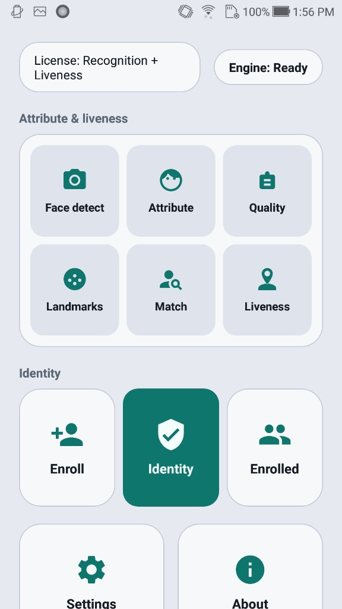
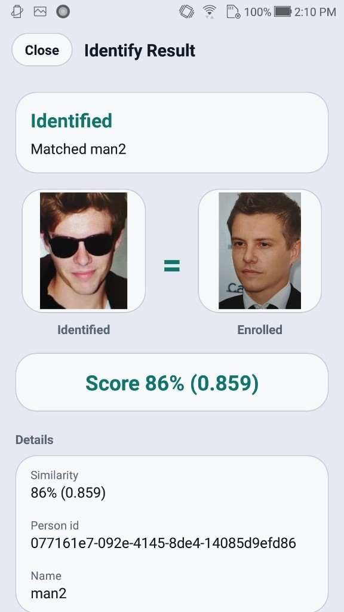
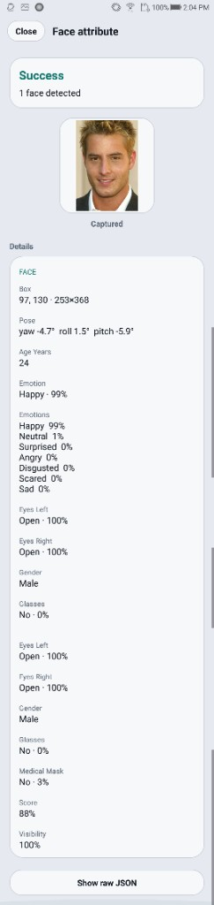

# Face SDK — iOS


## Overview

On-device face recognition SDK for iOS: enrollment, 1:N identification, and face attributes. Passive liveness is available when the license allows it.

Everything runs **on-premise** (on the phone or on your server). Identixia does **not** receive biometric images or templates.

| | |
| --- | --- |
| **Product repository** | `FaceRecognition-LivenessDetection-iOS` |
| **Platform** | iOS |
| **Docs site** | [docs.identixia.com](https://docs.identixia.com) |


### Repository



Source: [`identixia-IDV/FaceRecognition-LivenessDetection-iOS`](https://github.com/identixia-IDV/FaceRecognition-LivenessDetection-iOS)

## What you can do

| Capability | Description |
| --- | --- |
| Detect faces | Bounding box, landmarks, pose |
| Attributes | Age / gender / expression-style traits when enabled |
| Image / face quality | ICAO-style quality scores |
| Templates | Compact face feature vectors you store yourself |
| 1:1 match | Compare two images or two templates |
| 1:N identify | Enroll gallery + live search (mobile VideoWorker / server gallery) |
| Passive liveness | Presentation-attack score when the license includes it |

## Prerequisites

| Requirement | Detail |
| --- | --- |
| IDE | Xcode (recent stable) |
| Device | Physical iPhone for camera demos |
| Deployment | iOS 13+ (see sample project) |
| Frameworks | Vendored `.framework` / `.xcframework` from Release or Drive pack |

## Quick start

### 1. Clone the sample

```bash
git clone https://github.com/identixia-IDV/FaceRecognition-LivenessDetection-iOS.git
cd FaceRecognition-LivenessDetection-iOS
```

### 2. Place the runtime

Engine zip/AAR/framework from GitHub Releases (`/releases/latest/download/…`) or the files already under `libfacesdk` / Frameworks when present.

Clients should download versioned assets via:

```text
https://github.com/identixia-IDV/FaceRecognition-LivenessDetection-iOS/releases/latest/download/<asset>
```

### 3. Run the demo

Follow the repository **Run** section (Android Studio / Xcode / `flutter run` / `yarn android` / Ionic). Wait until status shows **Ready** before opening camera modes.

### 4. Try every demo mode

Use each tile / screen once (enroll, identify, capture, document front/back, result, about). Confirm license state on the About / Result screen.


## License and activation (mobile)

| | |
| --- | --- |
| **Demo id** | `com.identixia.facerecognitionsdk` (Android) / matching iOS bundle id in the sample |
| **Demo key** | Bundled for the sample id only |
| **Your app** | New applicationId / bundle id → request a new license |

### Activate → init (concept)

1. Call activate with your license string (background thread).
2. On success, call init (unpacks on-device models; may take a few seconds the first time).
3. Gate UI on Ready / license status before camera modes.
4. Never paste the demo key into a production app id.


### Status codes

| Code | Meaning |
| ---: | ------- |
| `0` | Success |
| `1` / `-1` | Invalid license |
| `2` / `-2` | Wrong application / bundle id |
| `3` / `-3` | License expired |
| `4` / `-4` | Not activated |
| `-5` | Init / model load failed |
| `-10` | Invalid argument |
| `-11` | Invalid image |
| `-12` | No face |
| `-13` | No document |
| `-16` | Liveness failed (when gated) |

Serialize native SDK calls on **one background thread**. The engine is not concurrent.


## API reference — mobile face SDK

Prefer **`FaceRecognitionClient`** (Android kit) / the matching iOS kit wrappers. Serialize all engine calls on one queue.

### Lifecycle

| API | Purpose |
| --- | --- |
| `activate(license)` | Activate + init on a worker thread; completion returns status code |
| `deactivate()` / `release()` | Tear down engine |
| `getLicenseStatus()` | Current license flags |
| `allowsRecognition()` / `allowsLiveness()` | Capability checks |

### Still-image recognition

| API | Purpose |
| --- | --- |
| `detect(bitmap, crop?, flags?)` | Detect faces; JSON string with regions / landmarks / traits |
| `faceDetection(bitmap, param?)` | Typed `FaceBox` list |
| `templateExtraction(bitmap, face)` | Template bytes for one face box |
| `extractFeature(bitmap)` | Feature bytes (largest / primary face helpers) |
| `similarity(feature1, feature2)` | 1:1 score between templates |
| `quality(bitmap, crop?)` | Quality attributes JSON |
| `setLandmarkMode(14\|68)` | Landmark density |

### Gallery (on-device 1:N)

| API | Purpose |
| --- | --- |
| `enroll(name, feature, thumbnail?)` | Store person locally |
| `bestMatch(feature, threshold)` | 1:N search |
| `enrolledPeople()` / `removeEnrolled` / `clearEnrolled` | Gallery management |
| `syncDatabase(matchThreshold)` | Push templates into VideoWorker DB |

### Live camera (VideoWorker)

| API | Purpose |
| --- | --- |
| `startVideoWorker(config)` | Start tracking / identify session |
| `addFrame(bitmap)` | Push camera frames |
| `setVideoWorkerEventHandler` | Receive track / match / liveness events (JSON) |
| `stopVideoWorker()` | Stop session |
| `makeTrackingConfig` / `makeIdentityConfig` | Build configs (passive / active liveness options when licensed) |

### Passive liveness

When the license includes liveness, still-image detect/quality paths and VideoWorker configs can return passive 2D scores. Use `passive2DVerdict` helpers in the kit. Without the entitlement, treat missing scores as **not run**, not as pass.

### Integration checklist

1. Apply `install.gradle` (Android) or vendor iOS frameworks from Release.
2. `FaceRecognitionClient.get(context).activate(license) { code -> … }`.
3. On `0`, enable camera modes.
4. Enroll → Identify, or Capture / Attribute for still flows.
5. Persist templates in **your** database if you leave the demo gallery.

## Troubleshooting

| Symptom | What to check |
| --- | --- |
| Invalid license | Application / bundle id must match the key; server needs the correct machine code |
| Init failed | Runtime AAR/framework/`lib` missing or wrong ABI |
| No face / no document | Lighting, crop, distance; try still gallery image first |
| Liveness / authenticity empty | License flag off — request the matching entitlement |
| Camera black / crash | Use a **physical** device; grant camera permission |
| Docker license fails after bare-metal license | Machine codes differ — re-license the container |

## Related platforms

| Platform | Docs |
| --- | --- |
| Android (full) | [Android](android.md) |
| iOS (full) | [iOS](ios.md) |
| Flutter (full) | [Flutter](flutter.md) |
| React Native (full) | [React Native](react-native.md) |
| Ionic Capacitor (full) | [Ionic Capacitor](ionic-capacitor.md) |
| Ionic Cordova (full) | [Ionic Cordova](ionic-cordova.md) |
| Windows (full) | [Windows](windows.md) |
| Linux / Docker (full) | [Linux / Docker](linux-docker.md) |
| Windows (recognition only) | [Recognition Windows](recognition-windows.md) |
| Linux (recognition only) | [Recognition Linux / Docker](recognition-linux-docker.md) |
| Liveness-only | [Android](liveness-android.md) · [iOS](liveness-ios.md) · [Windows](liveness-windows.md) · [Docker](liveness-linux-docker.md) |
| Function guides | [Recognition](recognition.md) · [Liveness](liveness.md) |

## Screenshots

<figure><figcaption>iOS home</figcaption></figure>

<figure><figcaption>iOS capture</figcaption></figure>

<figure><figcaption>iOS identify</figcaption></figure>

<figure><figcaption>iOS attributes</figcaption></figure>

<figure><figcaption>iOS liveness</figcaption></figure>

<figure><figcaption>iOS about</figcaption></figure>


## Support



## Product README (reference)

Adapted from the shipping repository README for exact commands and platform-specific notes. Screenshots above use the current Identixia asset pack.

## Identixia Face Recognition — iOS

**On-device face recognition SDK** for iPhone: enroll, **1:N identification**, capture, attributes, and optional **passive face liveness**. Face template matching stays on device — Identixia cloud never sees your biometric frames. Built for private KYC selfie flows and on-device galleries.

Demo modes: **Enroll · Identify · Capture · Attribute**.

---

## Basics

Read this once before cloning. Mobile demos ship a **bundled license** for the sample application / bundle id. Production apps need a new key from Identixia. [Initial commands](#-initial-commands) lists clone → place runtime → run → activate options.

| Topic | Basic information |
| --- | --- |
| **Product** | On-device **face recognition SDK** for iOS |
| **Modes** | Enroll · Identify (1:N) · Capture · Attribute · optional passive liveness |
| **Runtime zip** | Three frameworks at repo root from Drive zip `PENDING` |
| **Demo id / license** | `com.identixia.facerecognitionsdk.app` — use the sample id with the bundled demo license |
| **Activate** | Sample app: keep the demo id and bundled key. Your app: new applicationId / bundle id → [contact](#-contact) → call the SDK activate API (see docs). |
| **Tools** | **Xcode 15+** · physical **iPhone** |
| **UI** | Four demo modes after Ready |
| **Privacy** | Templates stay on device — no Identixia cloud |

---

## Initial commands

Clone the sample, place the runtime, and run it.

```bash
git clone https://github.com/identixia-IDV/FaceRecognition-LivenessDetection-iOS.git
cd FaceRecognition-LivenessDetection-iOS
```

Download the runtime zip (`PENDING`) and place at repo root:

```text
facerecognitionsdk.framework
FaceRecognitionEngine.framework
onnxruntime.framework
```

Open `FaceRecognitionSDK.xcodeproj` → Signing Team → Run on a physical iPhone.

Please [contact us](#-contact) to get a license for your own app. The sample already includes a demo license for its application id.

Wait until Home status = **Ready**, then use Camera / Gallery (or the face mode tiles). Confirm Result / About shows a licensed state before integrating into your own app.

---

## What you get

| Capability | What it does |
| --- | --- |

---

## Demo modes

| Mode | What to try |
| --- | --- |
| **Enroll** | Store an on-device face template |
| **Identify** | Live 1:N against enrolled people |
| **Capture** | Guided still capture |
| **Attribute** | Attribute readout when enabled |

---

## Requirements

| | |
| --- | --- |
| Device | Physical **iPhone** |
| Tools | **Xcode 15+** |
| Demo bundle id | `com.identixia.facerecognitionsdk.app` |
| Frameworks | `facerecognitionsdk` · `FaceRecognitionEngine` · `onnxruntime` |

---

## Runtime zip

> **Google Drive (single zip):** `PENDING`

Unzip to the repo root (siblings of the Xcode project):

```text
facerecognitionsdk.framework
FaceRecognitionEngine.framework
onnxruntime.framework
```

---

## Run

```text
1. git clone https://github.com/identixia-IDV/FaceRecognition-LivenessDetection-iOS.git
2. Place the three frameworks at the repo root
3. Open FaceRecognitionSDK.xcodeproj → set Signing Team
4. Keep bundle id com.identixia.facerecognitionsdk.app for the demo license
5. Run on a physical iPhone → Enroll / Identify / Capture / Attribute
```

---

## License

| | |
| --- | --- |
| Demo bundle id | `com.identixia.facerecognitionsdk.app` |
| Capabilities | Face recognition and/or passive face liveness |

The code below shows how to use the license:

[https://github.com/identixia-IDV/FaceRecognition-LivenessDetection-iOS/blob/6447a98d25ac6c9a2476c29ace46e818020a4cd8/FaceRecognitionSDK/Home/ViewController.swift#L8-L10](https://github.com/identixia-IDV/FaceRecognition-LivenessDetection-iOS/blob/6447a98d25ac6c9a2476c29ace46e818020a4cd8/FaceRecognitionSDK/Home/ViewController.swift#L8-L10)

[https://github.com/identixia-IDV/FaceRecognition-LivenessDetection-iOS/blob/6447a98d25ac6c9a2476c29ace46e818020a4cd8/FaceRecognitionSDK/Home/ViewController.swift#L167-L191](https://github.com/identixia-IDV/FaceRecognition-LivenessDetection-iOS/blob/6447a98d25ac6c9a2476c29ace46e818020a4cd8/FaceRecognitionSDK/Home/ViewController.swift#L167-L191)

Please [contact us](#-contact) to get a license for **your own app**.

---

## Use in your app

Link the three frameworks, activate → init, then detect / template / match (and liveness when licensed). Do not ship a production key against the demo bundle id. See [docs](https://docs.identixia.com).

---

## Platforms

| | Platform | Repo |
| --- | --- | --- |

---
