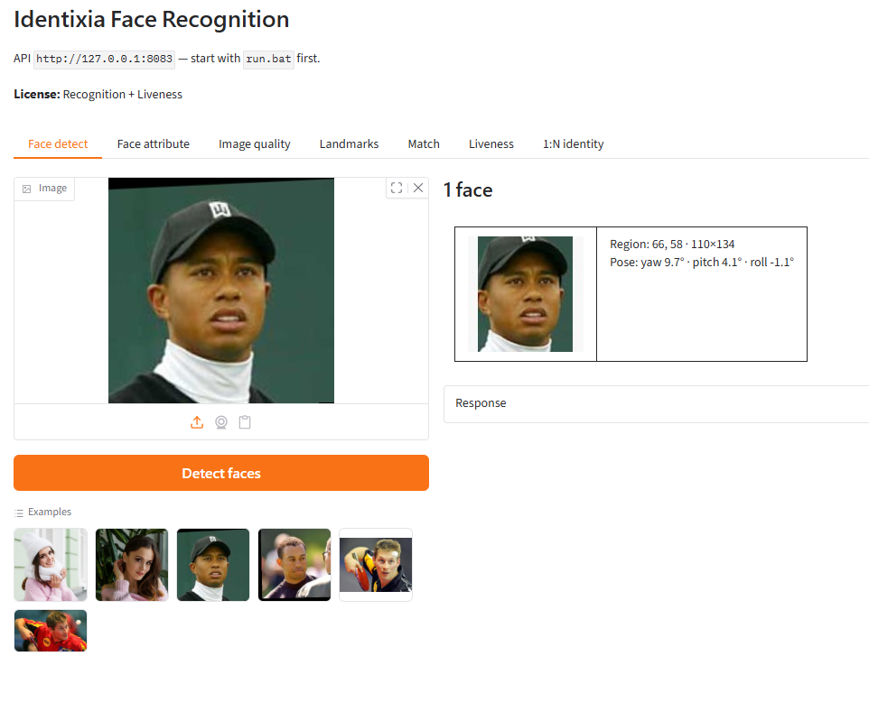
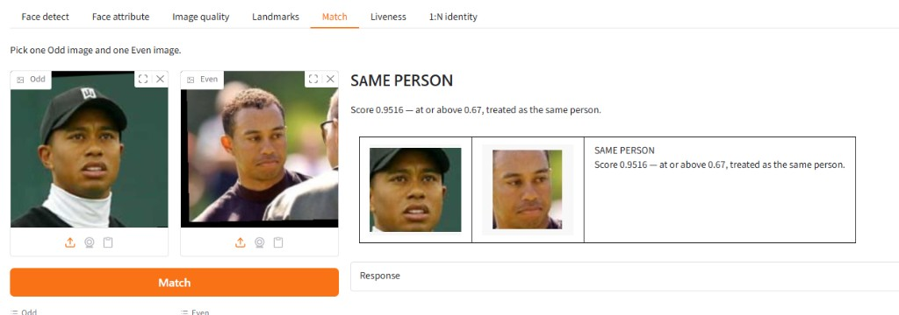
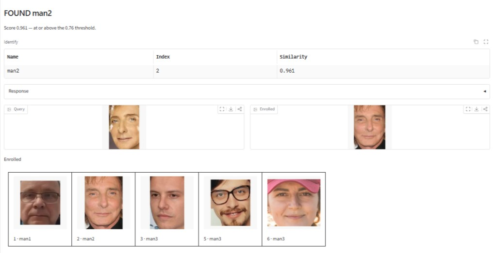

# Face SDK — Linux / Docker (recognition + liveness)


## Overview

On-premise face recognition SDK for Linux and Docker with passive liveness. Detection, quality, templates, and 1:1 match. Liveness routes require the matching license.

Processing runs **on your server (or in your container)**. Identixia does **not** receive biometric images, templates, or document scans.

| | |
| --- | --- |
| **Repository** | [`FaceRecognition-LivenessDetection-Docker`](https://github.com/identixia-IDV/FaceRecognition-LivenessDetection-Docker) |
| **Platform** | Linux |
| **Documentation** | [docs.identixia.com](https://docs.identixia.com) |


## Repository



[`identixia-IDV/FaceRecognition-LivenessDetection-Docker`](https://github.com/identixia-IDV/FaceRecognition-LivenessDetection-Docker) · [Releases](https://github.com/identixia-IDV/FaceRecognition-LivenessDetection-Docker/releases/latest)

## Capabilities

| Capability | Description |
| --- | --- |
| Face detection | Bounding box, landmarks, and pose |
| Attributes | Age, gender, and related traits when enabled |
| Quality | ICAO-style image and face quality scores |
| Templates | Compact feature vectors stored in **your** database |
| 1:1 match | Compare two images or two templates |
| 1:N identify | Enroll a gallery and search (mobile VideoWorker / server gallery) |
| Passive liveness | Presentation-attack score when the license includes `liveness` |

## Prerequisites

| Requirement | Detail |
| --- | --- |
| Host | Linux x86_64 or any Docker host |
| Docker | Optional — same repository builds the image |
| Port | Face **14103** · Document **14102** · Document liveness **14106** (product-specific) |
| Machine code | Different for bare metal vs container — license the environment you ship |

## Quick start (server)

Default API port for this product family: **`14103`**.

### 1. Clone and start

```bash
git clone https://github.com/identixia-IDV/FaceRecognition-LivenessDetection-Docker.git
cd FaceRecognition-LivenessDetection-Docker
# Follow README: place lib/ runtime, then start the HTTP server / demo UI
```

### 2. Machine code → license → activate

```bash
curl -s http://127.0.0.1:14103/api/machinecode
# Send data.machinecode to Identixia → receive license
curl -s -X POST http://127.0.0.1:14103/api/activate \
  -H "Content-Type: text/plain" \
  --data-binary @license.txt
curl -s http://127.0.0.1:14103/api/licenseStatus
curl -s http://127.0.0.1:14103/api/health
```

You can also drop `license.txt` next to the server and restart.

### Try a process call

```bash
curl -s -X POST http://127.0.0.1:14103/api/face/analyze \
  -H "Content-Type: application/json" \
  -d "{\"image\":\"BASE64_JPEG\"}"
```

### Docker (when the repo ships an image)

```bash
# See the repository README for the exact image name and tags (CPU/GPU).
docker compose up -d   # or the documented docker run line
curl -s http://127.0.0.1:PORT/api/health
```


## License and activation (server)

1. Start the API (it stays up even without a key so you can read the machine code).
2. `GET /api/machinecode` → copy `data.machinecode`.
3. Contact Identixia with that code (Docker and bare metal codes differ).
4. `POST /api/activate` with the license file/bytes **or** place `license.txt` and restart.
5. `GET /api/licenseStatus` → check capability flags (`recognition`, `liveness` / `authenticity`).

Control routes return the envelope `{success, code, message, request_id, data}`. Process routes return **engine / process JSON** (not the control envelope).

## API reference — HTTP (Windows / Linux / Docker)

Base URL: `http://{host}:14103`

### Control routes (envelope)

| Method | Path | Description |
| --- | --- | --- |
| `GET` | `/api/health` | Process up (no license required) |
| `GET` | `/api/backend` | Backend / SDK info |
| `GET` | `/api/machinecode` | Machine fingerprint for licensing |
| `GET` | `/api/licenseStatus` | Flags: `recognition`, `liveness` |
| `POST` | `/api/activate` | License text, JSON `{"license":"…"}`, or multipart |

### Process routes (engine / process JSON)

Same path accepts JSON (base64 fields) or `multipart/form-data` (`image`, `image1`, `image2`, …).

| Method | Path | Body (summary) | Description |
| --- | --- | --- | --- |
| `POST` | `/api/face/analyze` | `image`, optional `cropImage` | Full analyze |
| `POST` | `/api/face/boxes` | `image` | Face boxes |
| `POST` | `/api/face/traits` | `image` | Attributes |
| `POST` | `/api/face/image-quality` | `image` | Image quality |
| `POST` | `/api/face/landmarks` | `image`, `mode` `14` or `68` | Landmarks |
| `POST` | `/api/face/quality` | `image` | Face quality |
| `POST` | `/api/face/template` | `image` | Template / feature |
| `POST` | `/api/face/compare` | `image1`, `image2` | 1:1 image match |
| `POST` | `/api/face/score` | `feature1`, `feature2` | Template similarity |

| `POST` | `/api/face/liveness` | `{ "image": "<b64>" }` | Passive liveness (license-gated) |
| `POST` | `/api/face/deepfake` | `{ "image": "<b64>" }` | Deepfake score when enabled |
| `POST` | `/api/face/enroll` | `{ "image", "name" }` | Server gallery enroll |
| `POST` | `/api/face/search` | `{ "image", "threshold" }` | 1:N search |
| `DELETE` | `/api/face/gallery/{id}` | — | Remove gallery entry |

### Example — compare two images

```bash
curl -s -X POST http://127.0.0.1:14103/api/face/compare \
  -H "Content-Type: application/json" \
  -d '{"image1":"BASE64_JPEG","image2":"BASE64_JPEG"}'
```

### Example — template similarity

```bash
curl -s -X POST http://127.0.0.1:14103/api/face/score \
  -H "Content-Type: application/json" \
  -d '{"feature1":"<b64>","feature2":"<b64>"}'
```

## Troubleshooting

| Symptom | What to check |
| --- | --- |
| Invalid license | Application / bundle id must match the key; server needs the correct machine code |
| Init failed | Runtime AAR/framework/`lib` missing or wrong ABI |
| No face / no document | Lighting, crop, distance; try still gallery image first |
| Liveness / authenticity empty | License flag off — request the matching entitlement |
| Camera black / crash | Use a **physical** device; grant camera permission |
| Docker license fails after bare-metal license | Machine codes differ — re-license the container |

| Port in use | Change host port or stop the other Identixia server |
| Multipart vs JSON | Field names must match (`image`, `image1`, `images`) |
| Envelope vs process JSON | Only control routes use `{success,code,…}`; process routes return engine JSON |

## Related platforms

Keep the same license product line across stacks. From the [Face SDK](README.md) hub:

| Platform | Docs |
| --- | --- |
| Android (full) | [Android](android.md) |
| iOS (full) | [iOS](ios.md) |
| Flutter (full) | [Flutter](flutter.md) |
| React Native (full) | [React Native](react-native.md) |
| Ionic Capacitor (full) | [Ionic Capacitor](ionic-capacitor.md) |
| Ionic Cordova (full) | [Ionic Cordova](ionic-cordova.md) |
| Windows (full) | [Windows](windows.md) |
| Linux / Docker (full) | [Linux / Docker](linux-docker.md) |
| Windows (recognition only) | [Recognition Windows](recognition-windows.md) |
| Linux (recognition only) | [Recognition Linux / Docker](recognition-linux-docker.md) |
| Liveness-only | [Android](liveness-android.md) · [iOS](liveness-ios.md) · [Windows](liveness-windows.md) · [Docker](liveness-linux-docker.md) |
| Function guides | [Recognition](recognition.md) · [Liveness](liveness.md) |

## Screenshots

<figure><figcaption>Desktop detect</figcaption></figure>

<figure><figcaption>Desktop 1:1 match</figcaption></figure>

<figure><figcaption>Desktop liveness</figcaption></figure>

<figure><figcaption>Desktop identify</figcaption></figure>

## Next steps

1. Complete **Quick start** until the sample shows **Ready**.
2. Activate with a license issued for **your** application id or machine code.
3. Call only the APIs your license allows; treat missing flags as “not evaluated”, not as pass.
4. Return to the [Face SDK](README.md) hub for recognition, liveness, and related platforms.


## Support



## Repository README

The following notes are adapted from the shipping repository README (exact commands and platform-specific details). Screenshots on this page use the Identixia documentation asset pack.

## Identixia Face Recognition SDK — Linux / Docker

**On-premise face recognition SDK** with **passive face liveness** as a Linux / Docker HTTP API: detect, quality, face template matching, 1:1 compare, and PAD. Biometrics stay in your cluster — ideal for KYC backends and private access control. Image: [`identixia/face-recognition-liveness-sdk`](https://hub.docker.com/r/identixia/face-recognition-liveness-sdk).

---

## Basics

Start the server, copy the machine code, and contact us with that code to get a license. Then replace the key in `license.txt` and activate.

| Topic | Basic information |
| --- | --- |
| **Product** | On-premise **face recognition SDK** Linux / Docker (+ passive liveness) |
| **Modes** | Detect · quality · templates · 1:1 match · PAD |
| **What you run** | HTTP API on port **14103** |
| **Machine code** | `GET /api/machinecode` prints `data.machinecode`. Please contact us with that machine code to get a license. |
| **Activate** | Replace the key in the included `license.txt`, then send that file with `POST /api/activate`. |
| **Check status** | `GET /api/health` and `GET /api/licenseStatus` after activate |
| **Runtime** | Included in the Docker image |
| **Tools** | Linux x64 with Docker |
| **Privacy** | Biometrics stay in your cluster — no Identixia cloud |

---

## Initial commands

```bash
docker pull identixia/face-recognition-liveness-sdk:latest
docker run -d --name identixia-api -p 14103:14103 \
  -v /etc/machine-id:/etc/machine-id:ro \
  identixia/face-recognition-liveness-sdk:latest
```

```bash
curl -s http://127.0.0.1:14103/api/machinecode
```

The response is JSON. Your machine code is `data.machinecode`.

Please [contact us](#-contact) with the machine code to get a license.

This repository includes `license.txt`. Replace the key in that file with the license we send you, then run this command from the repository folder:

```bash
curl -s -X POST http://127.0.0.1:14103/api/activate -H "Content-Type: text/plain" --data-binary @license.txt
```

```bash
curl -s http://127.0.0.1:14103/api/health
```

Replace `BASE64_JPEG` with a base64-encoded JPEG.

Detect a face:

```bash
curl -s -X POST http://127.0.0.1:14103/api/face/analyze -H "Content-Type: application/json" -d "{\"image\":\"BASE64_JPEG\"}"
```

Compare two faces:

```bash
curl -s -X POST http://127.0.0.1:14103/api/face/compare -H "Content-Type: application/json" -d "{\"image1\":\"BASE64_JPEG\",\"image2\":\"BASE64_JPEG\"}"
```

Check liveness:

```bash
curl -s -X POST http://127.0.0.1:14103/api/face/liveness -H "Content-Type: application/json" -d "{\"image\":\"BASE64_JPEG\"}"
```

Gradio runs on your computer, not inside the container. Clone this repository, keep the API running, then open a second terminal in the repository folder.

```bash
pip3 install -r requirements-demo.txt
./run_demo.sh
```

Open http://127.0.0.1:14203

---

## What you get

| Capability | What it does |
| --- | --- |
| Face detection | Bounding box, landmarks, pose, and attributes |
| Quality | Face quality score |
| Templates | Template extraction and 1:1 match |
| Passive liveness | Runs when the license allows it |

---

## Requirements

| | |
| --- | --- |
| Host | Linux x64 with Docker |
| Ports | API **14103**, Gradio **14203** |
| Licensing | Bind-mount `/etc/machine-id` for stable machine codes |

---

## Gradio demo

Gradio runs on your computer, not inside the container. Clone this repository, keep the API running, then open a second terminal in the repository folder.

```bash
pip3 install -r requirements-demo.txt
./run_demo.sh
```

Open http://127.0.0.1:14203

---

## Use in your app

Point your backend at `http://<host>:14103` for detect, match, and liveness. See [docs](https://docs.identixia.com).

---

## Platforms

| | Platform | Repo |
| --- | --- | --- |

---
