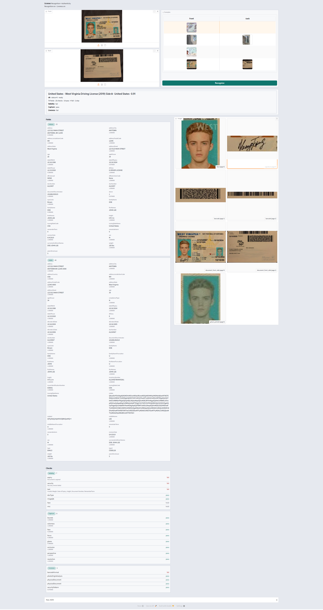

# ID Document Recognition SDK


## Overview

ID document recognition SDK for Android, iOS, Windows, and Docker. OCR, MRZ, and barcode extraction for passports, national IDs, and driver licenses. Document liveness requires the matching license.

Everything runs **on-premise** (on the phone or on your server). Identixia does **not** receive biometric images or templates.

| | |
| --- | --- |
| **Product repository** | `ID-Document-Recognition-Liveness-Detection-SDK` |
| **Platform** | Hub |
| **Docs site** | [docs.identixia.com](https://docs.identixia.com) |


### Repository



Source: [`identixia-IDV/ID-Document-Recognition-Liveness-Detection-SDK`](https://github.com/identixia-IDV/ID-Document-Recognition-Liveness-Detection-SDK)

## What you can do

See the platform pages linked below for capabilities.

## Prerequisites

See the product README for toolchain details.

## Start here

Open the platform page that matches your license and stack. Each page includes quick start, activation, full API reference, and troubleshooting.

## Screenshots

<figure><figcaption>Document recognition result UI</figcaption></figure>

<figure><figcaption>Docker document result</figcaption></figure>


## Support



## Product README (reference)

Adapted from the shipping repository README for exact commands and platform-specific notes. Screenshots above use the current Identixia asset pack.

## Identixia ID Document Recognition and Liveness Detection SDK

**On-premise / on-device ID document recognition** for passports, national IDs, and driver licenses — passport MRZ OCR, ID card barcode, live capture, and optional document liveness / authenticity. Built for KYC and eKYC: **no** identity images or fields are sent to Identixia cloud.

Ship once across mobile, plugins, Windows, and Docker with the same product family and licensing model. Mobile demos use a wide Camera Home plus Gallery / About, and a one-scroll Result (identity → fields → checks → images → Raw JSON).

Docs: [docs.identixia.com](https://docs.identixia.com) · Docker: [`identixia/document-reader`](https://hub.docker.com/r/identixia/document-reader)

---

## Basics

Start here. Mobile samples include a demo license. Server samples print a machine code; please contact us with that machine code to get a license.

| Topic | Basic information |
| --- | --- |
| **Product** | On-premise / on-device **ID document recognition SDK** hub (KYC / eKYC) |
| **Documents** | Passport, national ID, driver license — OCR · passport MRZ · barcode / QR · optional document liveness |
| **Runtime** | One Google Drive zip per platform — see each App README (`PENDING` until URL is published) |
| **Machine code (servers)** | `GET /api/machinecode` prints `data.machinecode`. Please contact us with that machine code to get a license. |
| **Activate (servers)** | Replace the key in the included `license.txt`, then send that file with `POST /api/activate`. |
| **Activate (mobile)** | Keep the demo id for the sample key, or request a production key for your own applicationId / bundle id. |
| **Tools** | Pick Android / iOS / Flutter / RN / Ionic / Windows / Docker — each App README has the exact run path |
| **Ports** | Recognition API **14102**. Document liveness API **14107**. |
| **Privacy** | On-device or in your VPC — no Identixia cloud for document data |

---

## Initial commands

```bash
docker pull identixia/document-reader:latest
docker run -d --name identixia-document-reader \
  --shm-size=2gb --privileged \
  -p 14102:14102 \
  -v /etc/machine-id:/etc/machine-id:ro \
  identixia/document-reader:latest
```

```bash
curl -s http://127.0.0.1:14102/api/machinecode
```

The response is JSON. Your machine code is `data.machinecode`.

Please [contact us](#-contact) with the machine code to get a license.

This repository includes `license.txt`. Replace the key in that file with the license we send you, then run this command from the repository folder:

```bash
curl -s -X POST http://127.0.0.1:14102/api/activate -H "Content-Type: text/plain" --data-binary @license.txt
```

Replace `BASE64_JPEG` with a base64-encoded JPEG of the document.

```bash
curl -s -X POST http://127.0.0.1:14102/api/documentProcess -H "Content-Type: application/json" -d "{"images":[{"image":"BASE64_JPEG"}]}"
```

---

## Why Identixia

| | | |
| --- | --- | --- |

---

## What you get

| Capability | What it does |
| --- | --- |

| Surface | Ports / notes |
| --- | --- |
| Windows / Linux HTTP API | **14102** |
| Document liveness Docker | [ID-Document-Liveness-Detection-Docker](https://github.com/identixia-IDV/ID-Document-Liveness-Detection-Docker) · API **14107** |

---

## How to evaluate

1. Pick a **platform repo** from the table below (public GitHub name).
2. Download that platform’s **runtime zip** (Drive link is `PENDING` in each App README until published).
3. Follow the numbered **Run** section — clone URL, extract path, and exact scripts are listed there.
4. Mobile: wait for Home **Ready**, then Camera / Gallery. Server: hit `/api/health` on **14102**.

Demo mobile licenses (where bundled) target `com.identixia.documentreader` / `com.identixia.documentreader.app` until **12 Aug 2027**.

---

## Runtime zips

Each platform App README names a **Google Drive single zip** (`PENDING` until links are published). Unzip so binaries sit at the documented path — not nested in an extra folder. One zip per runtime (Android AAR, iOS framework, Windows/Linux `lib/cpu`, etc.).

---

## Choose platform

| | Platform | Repo |
| --- | --- | --- |

Document authenticity API only: [ID-Document-Liveness-Detection-Docker](https://github.com/identixia-IDV/ID-Document-Liveness-Detection-Docker)

---

## Also from Identixia

- [Face Recognition SDK](https://github.com/identixia-IDV/Face-Recognition-SDK) — on-device and on-premise face recognition, with passive liveness when the license includes it
- [Face Liveness Detection](https://github.com/identixia-IDV/Face-Liveness-Detection-SDK)

---

### Platforms in this section

* [ID Document Recognition Android SDK](id-document-recognition-android-sdk.md)
* [ID Document Recognition iOS SDK](id-document-recognition-ios-sdk.md)
* [ID Document Recognition Flutter SDK](id-document-recognition-flutter-sdk.md)
* [ID Document Recognition React Native SDK](id-document-recognition-react-native-sdk.md)
* [ID Document Recognition Ionic Capacitor SDK](id-document-recognition-ionic-capacitor-sdk.md)
* [ID Document Recognition Ionic Cordova SDK](id-document-recognition-ionic-cordova-sdk.md)
* [ID Document Recognition Windows SDK](id-document-recognition-windows-sdk.md)
* [ID Document Recognition Linux / Docker SDK](id-document-recognition-linux-sdk.md)
* [Document result JSON](document-result-json.md)
* [Document security check fields](document-security-check-fields.md)
