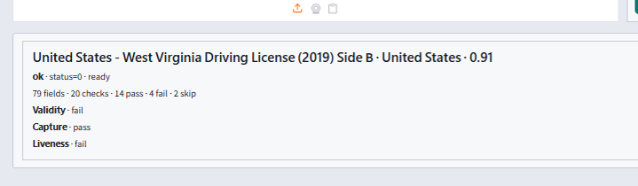
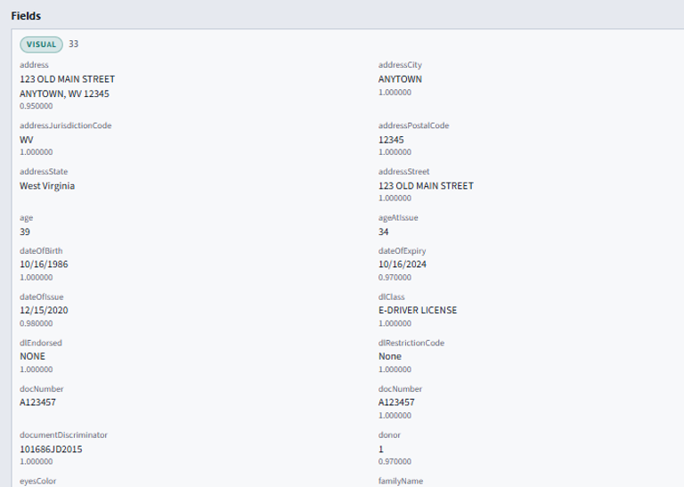
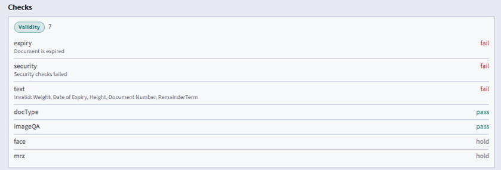
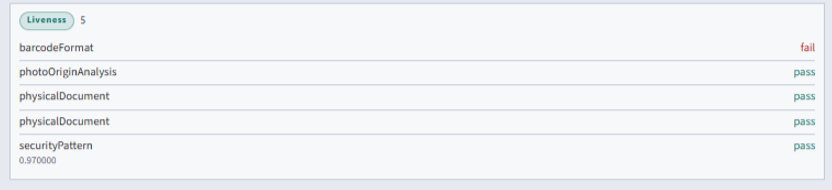
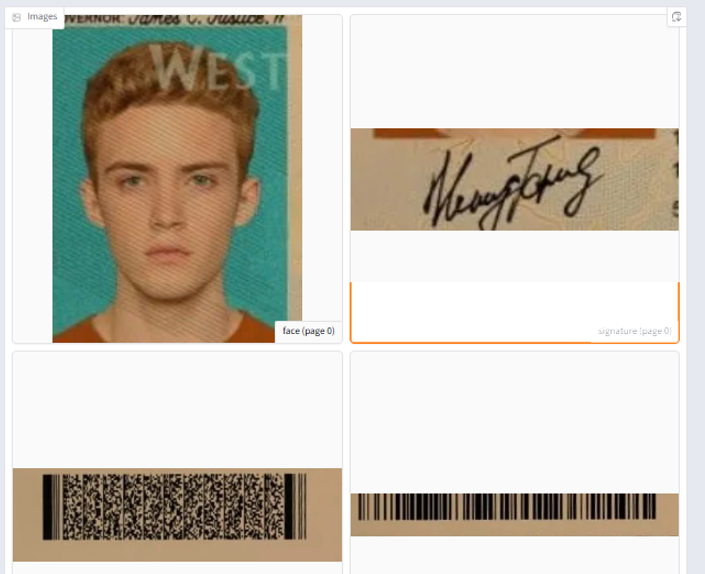

# ID Document SDK — Ionic Cordova


## Overview

Ionic Cordova ID document recognition plugin for Android and iOS. Passport, national ID, and driver license OCR, MRZ, and barcode capture. Document liveness runs when the license includes it.

Everything runs **on-premise** (on the phone or on your server). Identixia does **not** receive biometric images or templates.

| | |
| --- | --- |
| **Product repository** | `ID-Document-Recognition-Liveness-Detection-Ionic-Cordova` |
| **Platform** | Ionic-Cordova |
| **Docs site** | [docs.identixia.com](https://docs.identixia.com) |


### Repository



Source: [`identixia-IDV/ID-Document-Recognition-Liveness-Detection-Ionic-Cordova`](https://github.com/identixia-IDV/ID-Document-Recognition-Liveness-Detection-Ionic-Cordova)

## What you can do

| Capability | Description |
| --- | --- |
| Locate & crop | Find the ID document in a camera frame or still |
| OCR | Visual-zone fields (name, document number, dates, …) |
| MRZ | Machine-readable zone parse + checks |
| Barcode / QR | When present on the document |
| Front + back | Capture both sides when required |
| Document liveness | Authenticity / PAD checks when the license includes it |
| Structured JSON | Same result idea on mobile and server |

## Prerequisites

| Requirement | Detail |
| --- | --- |
| Node | 18+ |
| Ionic CLI | Current stable |
| Android / iOS | Native toolchains as for Capacitor or Cordova |
| Device | Physical phone for camera capture |

## Quick start

### 1. Clone the sample

```bash
git clone https://github.com/identixia-IDV/ID-Document-Recognition-Liveness-Detection-Ionic-Cordova.git
cd ID-Document-Recognition-Liveness-Detection-Ionic-Cordova
```

### 2. Place the runtime

Engine AAR / `docsdk` framework from Releases (`documentreadersdk.aar` / `docsdk.xcframework.zip`) or local `libdocsdk`.

Clients should download versioned assets via:

```text
https://github.com/identixia-IDV/ID-Document-Recognition-Liveness-Detection-Ionic-Cordova/releases/latest/download/<asset>
```

### 3. Run the demo

Follow the repository **Run** section (Android Studio / Xcode / `flutter run` / `yarn android` / Ionic). Wait until status shows **Ready** before opening camera modes.

### 4. Try every demo mode

Use each tile / screen once (enroll, identify, capture, document front/back, result, about). Confirm license state on the About / Result screen.


## License and activation (mobile)

| | |
| --- | --- |
| **Demo id** | Sample application / bundle id shipped in the repo (document reader demo) |
| **Demo key** | Bundled for the sample id only |
| **Your app** | New applicationId / bundle id → request a new license |

### Activate → init (concept)

1. Call activate with your license string (background thread).
2. On success, call init (unpacks on-device models; may take a few seconds the first time).
3. Gate UI on Ready / license status before camera modes.
4. Never paste the demo key into a production app id.


### Status codes

| Code | Meaning |
| ---: | ------- |
| `0` | Success |
| `1` / `-1` | Invalid license |
| `2` / `-2` | Wrong application / bundle id |
| `3` / `-3` | License expired |
| `4` / `-4` | Not activated |
| `-5` | Init / model load failed |
| `-10` | Invalid argument |
| `-11` | Invalid image |
| `-12` | No face |
| `-13` | No document |
| `-16` | Liveness failed (when gated) |

Serialize native SDK calls on **one background thread**. The engine is not concurrent.


## API reference — mobile document SDK

### Lifecycle

| API | Purpose |
| --- | --- |
| Activate + init | License then load models (background thread) |
| License status | Recognition / authenticity flags |
| Session helpers | `startNewSession` / gallery session before recognize |

### Capture and recognize

| API | Purpose |
| --- | --- |
| Guide / crop helpers | Align document in frame (`DocumentGuideView` / kit crop) |
| `recognize(front, back?)` | Run OCR + MRZ + barcode (+ liveness when licensed) |
| Result parser | Map engine JSON → identity, fields, checks, images |

### Result JSON (shared idea)

Top-level concepts (names may be normalized per platform):

| Area | Contents |
| --- | --- |
| Identity | Document type, country, overall score |
| Fields / readings | OCR, MRZ, barcode field rows |
| Checks / tests | Verification + image quality + security |
| Images | Portrait / document crops (base64) |

See [Result JSON](result-json.md) and [Security check fields](security-fields.md).

### Integration checklist

1. Apply `install.gradle` or vendor iOS `docsdk`.
2. Activate with your app id license.
3. Capture front (and back when needed) → `recognize`.
4. Parse JSON in your app — do not depend on the demo Result UI.
5. Store fields you need in **your** database.

## Troubleshooting

| Symptom | What to check |
| --- | --- |
| Invalid license | Application / bundle id must match the key; server needs the correct machine code |
| Init failed | Runtime AAR/framework/`lib` missing or wrong ABI |
| No face / no document | Lighting, crop, distance; try still gallery image first |
| Liveness / authenticity empty | License flag off — request the matching entitlement |
| Camera black / crash | Use a **physical** device; grant camera permission |
| Docker license fails after bare-metal license | Machine codes differ — re-license the container |

## Screenshots

<figure><figcaption>Status</figcaption></figure>

<figure><figcaption>Visual fields</figcaption></figure>

<figure><figcaption>Validity checks</figcaption></figure>

<figure><figcaption>Liveness checks</figcaption></figure>

<figure><figcaption>Images</figcaption></figure>


## Support



## Product README (reference)

Adapted from the shipping repository README for exact commands and platform-specific notes. Screenshots above use the current Identixia asset pack.

## Identixia ID Document Recognition and Liveness Detection — Ionic Cordova

**On-device ID document recognition** plugin for Android and iOS: passport MRZ OCR, ID card barcode, live capture, and optional document liveness / authenticity for KYC and eKYC. Processing stays on the device — **no** document images go to Identixia cloud.

Package: `document-reader-cordova`.

**Cordova**. Capacitor: [ID-Document-Recognition-Liveness-Detection-Ionic-Capacitor](https://github.com/identixia-IDV/ID-Document-Recognition-Liveness-Detection-Ionic-Capacitor).

---

## Basics

Read this once before cloning. Plugin demos ship a **bundled license** for the sample Android / iOS ids. Production apps need a new key. [Initial commands](#-initial-commands) lists clone → place runtime → run → activate options.

| Topic | Basic information |
| --- | --- |
| **Product** | On-device **ID document recognition** Ionic Cordova plugin (KYC / eKYC) |
| **Documents** | Passport, national ID, driver license |
| **Extracts** | OCR · passport MRZ · barcode / QR · optional document liveness |
| **Runtime** | Android AAR + iOS framework from Drive zips `PENDING` |
| **Demo id** | `com.identixia.documentreader` / `.app` (until **12 Aug 2027**) |
| **Tools** | npm · Cordova · physical arm64 Android / iPhone |
| **UI** | Wide Camera Home · Gallery / About · one-scroll Result |
| **Privacy** | All processing on device — no Identixia cloud for document data |

---

## Initial commands

Must-know path for the sample / example app.

```bash
git clone https://github.com/identixia-IDV/ID-Document-Recognition-Liveness-Detection-Ionic-Cordova.git
cd ID-Document-Recognition-Liveness-Detection-Ionic-Cordova
# place Android + iOS runtimes first
npm install
npm run setup:android && npm run android
npm run setup:ios && npm run ios
```

Please [contact us](#-contact) to get a license for your own app. The sample already includes a demo license for its application id.

Wait until Home = **Ready**, then Camera / Gallery. Confirm Result / About shows a licensed state.

---

## What you get

| Capability | What it does |
| --- | --- |

---

## Requirements

| | |
| --- | --- |
| Devices | Physical **arm64** Android and/or **iPhone** |
| Demo Android id | `com.identixia.documentreader` |
| Demo iOS id | `com.identixia.documentreader.app` |
| Package | `document-reader-cordova` |

---

## Install

The example builds with native runtimes already in the clone when present. Missing files are fetched from the `v1.0.0` GitHub Releases.

| | Path after unzip |
| --- | --- |

Customer apps depend on `document-reader-cordova` from this repo at tag `v1.0.0` (Flutter: git; React Native / Ionic: npm / github). Do **not** use a monorepo `path:` dependency in shipping apps.

Prefer package kits (`DocumentCapture`, `ResultParser`) for the same camera / Result path as the sample. Keep `useLegacyPackaging = true` on Android when required by the engine.

---

## Run

```bash
git clone https://github.com/identixia-IDV/ID-Document-Recognition-Liveness-Detection-Ionic-Cordova.git
cd ID-Document-Recognition-Liveness-Detection-Ionic-Cordova
# place Android + iOS runtimes first
npm install
npm run setup:android && npm run android
npm run setup:ios && npm run ios
```

---

## License

Demo ids: Android `com.identixia.documentreader` · iOS `com.identixia.documentreader.app`. Demo license until **12 Aug 2027**.

The code below shows how to use the license:

[https://github.com/identixia-IDV/ID-Document-Recognition-Liveness-Detection-Ionic-Cordova/blob/877cd269a6018b377775a1add7834e4162644016/src/license.ts#L11-L20](https://github.com/identixia-IDV/ID-Document-Recognition-Liveness-Detection-Ionic-Cordova/blob/877cd269a6018b377775a1add7834e4162644016/src/license.ts#L11-L20)

[https://github.com/identixia-IDV/ID-Document-Recognition-Liveness-Detection-Ionic-Cordova/blob/877cd269a6018b377775a1add7834e4162644016/src/SdkContext.tsx#L63-L73](https://github.com/identixia-IDV/ID-Document-Recognition-Liveness-Detection-Ionic-Cordova/blob/877cd269a6018b377775a1add7834e4162644016/src/SdkContext.tsx#L63-L73)

Capabilities: document recognition and/or document liveness. Please [contact us](#-contact) to get a license for **your own app**.

---

## Use in your app

Add the Cordova plugin package `document-reader-cordova`, ensure the AAR and `docsdk.framework` are on the plugin native paths, then activate → init → recognize.

Depend on `document-reader-cordova` via **git** `ref: v1.0.0` (not a monorepo `path:`). Ship or download the AAR + framework, then activate → init → recognize.

---

## Platforms

| | Platform | Repo |
| --- | --- | --- |

---
