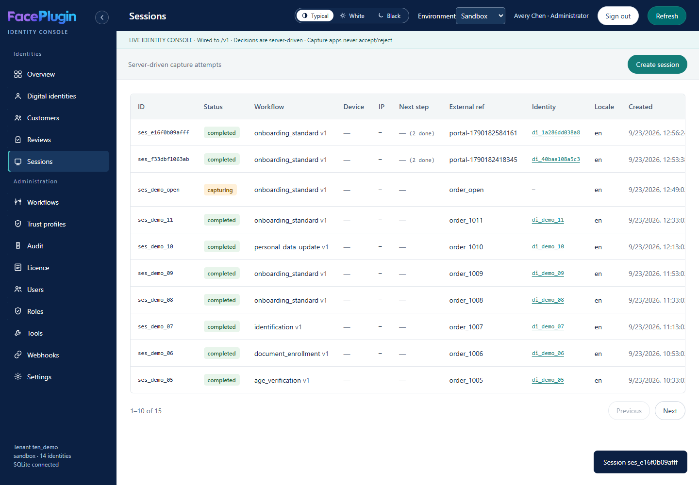
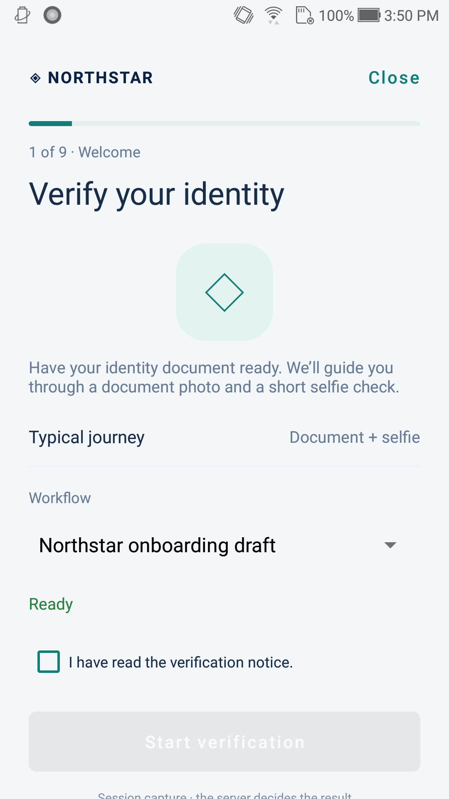

# IDV platform

<p align="center"></p>
<p align="center"></p>

## What IDV is

**IDV** is Identixia’s self-host identity-verification platform. It uses your on-premise **Document** and **Face** SDK HTTP engines as the biometric backend. It does not replace those SDKs — it orchestrates them between your company systems and applicant capture apps.

## Project components

| Component | Role | Folder · port |
| --- | --- | --- |
| **Platform (Admin)** | Tenant API, reviews, Identity Console | `idv-server/` · `:14187` · UI `:14188` / `/admin` |
| **Company (Merchant)** | Holds service credentials; starts sessions | `company-backend/` · `:14195` · Admin `:14189` |
| **Applicant (User)** | Web / mobile capture apps | `client/` · e.g. web `:5175` |
| **Engines** | Document + Face HTTP APIs | Document `:14102` · Face `:14103` |

```text
Applicant app ──► Company backend :14195 ──► IDV server :14187 ──► Face / Document engines
                      │                         │
               Company Admin :14189      Identity Console /admin
```

## Read this guide (in order)

1. [Project structure](project-structure.md)
2. [Prerequisites: engines](engines.md) — start and activate Document + Face first
3. [Project setup](environment.md) — `.env`, tokens, storage
4. [Initial setup process](initial-setup.md) — first console login, settings, webhook secret
5. [Quick start](quick-start.md) · [End-to-end walkthrough](walkthrough.md)
6. [Session states](session-states.md)
7. [Creating a session (API)](api.md)
8. [Webhook integration](company-webhooks.md)
9. [Applicant clients](components-clients.md) · [Production](production.md)

<figure><figcaption>Identity Console</figcaption></figure>
<figure><figcaption>Applicant capture</figcaption></figure>


**Safety:** Keep the company **service bearer** on the company backend only. Capture apps receive a short-lived **capture token**. Never commit secrets. `IDV_OPEN_API=1` / bearer `demo` is for **localhost demos only**. License Admin (`:14190`) stays on a private host.

