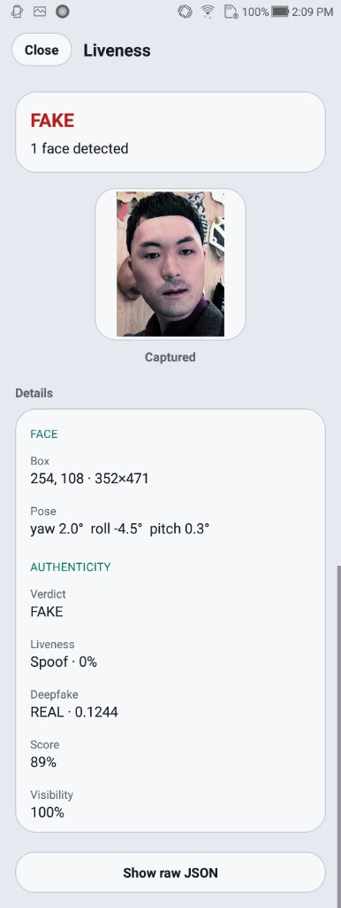
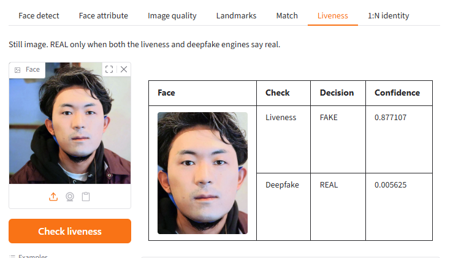

# Liveness Detection Windows SDK


## Overview

On-premise passive face liveness SDK for Windows. Scores one RGB face image through the local liveness API when the license allows it.

Everything runs **on-premise** (on the phone or on your server). Identixia does **not** receive biometric images or templates.

| | |
| --- | --- |
| **Product repository** | `FaceLivenessDetection-Windows` |
| **Platform** | Windows |
| **Docs site** | [docs.identixia.com](https://docs.identixia.com) |


### Repository



Source: [`identixia-IDV/FaceLivenessDetection-Windows`](https://github.com/identixia-IDV/FaceLivenessDetection-Windows)

## What you can do

| Capability | Description |
| --- | --- |
| Passive face liveness | Score one RGB face image / frame for presentation-attack detection |
| License gating | Liveness runs only when the license allows it |

## Prerequisites

| Requirement | Detail |
| --- | --- |
| OS | Windows 10/11 x64 |
| Runtime | Product `lib/` (CPU) next to the server |
| Python | As required by the sample server (see repo README) |
| Port | Face **14103** · Document **14102** (default) |
| License | `license.txt` or `POST /api/activate` |

## Quick start (server)

Default API port for this product family: **`14103`**.

### 1. Clone and start

```bash
git clone https://github.com/identixia-IDV/FaceLivenessDetection-Windows.git
cd FaceLivenessDetection-Windows
# Follow README: place lib/ runtime, then start the HTTP server / demo UI
```

### 2. Machine code → license → activate

```bash
curl -s http://127.0.0.1:14103/api/machinecode
# Send data.machinecode to Identixia → receive license
curl -s -X POST http://127.0.0.1:14103/api/activate \
  -H "Content-Type: text/plain" \
  --data-binary @license.txt
curl -s http://127.0.0.1:14103/api/licenseStatus
curl -s http://127.0.0.1:14103/api/health
```

You can also drop `license.txt` next to the server and restart.

### Try liveness

```bash
curl -s -X POST http://127.0.0.1:14103/api/liveness \
  -H "Content-Type: application/json" \
  -d "{\"image\":\"BASE64_JPEG\"}"
```


## License and activation (server)

1. Start the API (it stays up even without a key so you can read the machine code).
2. `GET /api/machinecode` → copy `data.machinecode`.
3. Contact Identixia with that code (Docker and bare metal codes differ).
4. `POST /api/activate` with the license file/bytes **or** place `license.txt` and restart.
5. `GET /api/licenseStatus` → check capability flags (`recognition`, `liveness` / `authenticity`).

Control routes return the envelope `{success, code, message, request_id, data}`. Process routes return **engine / process JSON** (not the control envelope).

## API reference — face liveness HTTP

Base URL: `http://{host}:14103` (confirm in the product README).

| Method | Path | Body | Description |
| --- | --- | --- | --- |
| `GET` | `/api/health` | — | Health |
| `GET` | `/api/machinecode` | — | License machine code |
| `GET` | `/api/licenseStatus` | — | Liveness entitlement |
| `POST` | `/api/activate` | license bytes / JSON | Activate |
| `POST` | `/api/liveness` | `{ "image": "<b64>", "algorithm": "all" }` | Passive liveness |
| `POST` | `/api/check_liveness` | same | Alias |

```bash
curl -s -X POST http://127.0.0.1:14103/api/liveness \
  -H "Content-Type: application/json" \
  -d '{"image":"BASE64_JPEG","algorithm":"all"}'
```

## Troubleshooting

| Symptom | What to check |
| --- | --- |
| Invalid license | Application / bundle id must match the key; server needs the correct machine code |
| Init failed | Runtime AAR/framework/`lib` missing or wrong ABI |
| No face / no document | Lighting, crop, distance; try still gallery image first |
| Liveness / authenticity empty | License flag off — request the matching entitlement |
| Camera black / crash | Use a **physical** device; grant camera permission |
| Docker license fails after bare-metal license | Machine codes differ — re-license the container |

| Port in use | Change host port or stop the other Identixia server |
| Multipart vs JSON | Field names must match (`image`, `image1`, `images`) |
| Envelope vs process JSON | Only control routes use `{success,code,…}`; process routes return engine JSON |

## Screenshots

<figure><figcaption>Mobile liveness result</figcaption></figure>

<figure><figcaption>Desktop liveness demo</figcaption></figure>


## Support



## Product README (reference)

Adapted from the shipping repository README for exact commands and platform-specific notes. Screenshots above use the current Identixia asset pack.

## Identixia Face Liveness — Windows

On-premise **passive face liveness** for Windows, including deepfake when the license allows it. This app ships the liveness model packs only. Matching and 1:N search are a separate app, `FaceRecognition-Windows`.

| Topic | Detail |
| --- | --- |
| API | `http://127.0.0.1:14105` |
| Demo | `http://127.0.0.1:14205` |
| Runtime | `lib\cpu\` — about **316 MB** |
| Models | `recognition-common.xdb`, `recognition-liveness.xdb`, `recognition-deepfake.xdb` |
| Left out | `recognition.xdb`, `recognition-attr.xdb`, `recognition-quality.xdb` |

`recognition-common.xdb` stays because the detector is shared. The matcher pack is not included.

```bat
pip install -r requirements.txt
run.bat
```

```bash
curl -s http://127.0.0.1:14105/api/machinecode
curl -s -X POST http://127.0.0.1:14105/api/activate -H "Content-Type: text/plain" --data-binary @license.txt
curl -s http://127.0.0.1:14105/api/health
```

Replace the key in `license.txt` with the liveness license for this machine. Then, in a second terminal:

```bat
pip install -r requirements-demo.txt
run_demo.bat
```

Liveness calls: `POST /api/face/liveness` and `POST /api/face/deepfake`.

---
